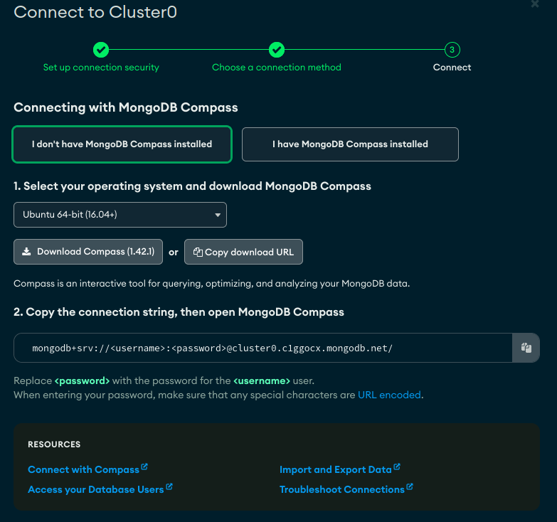
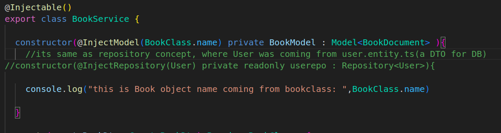
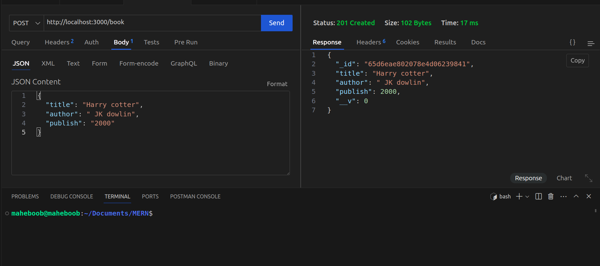
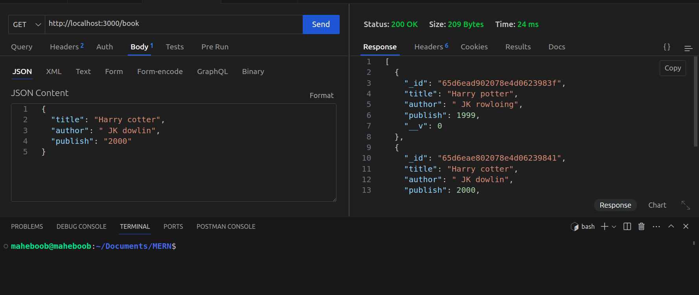
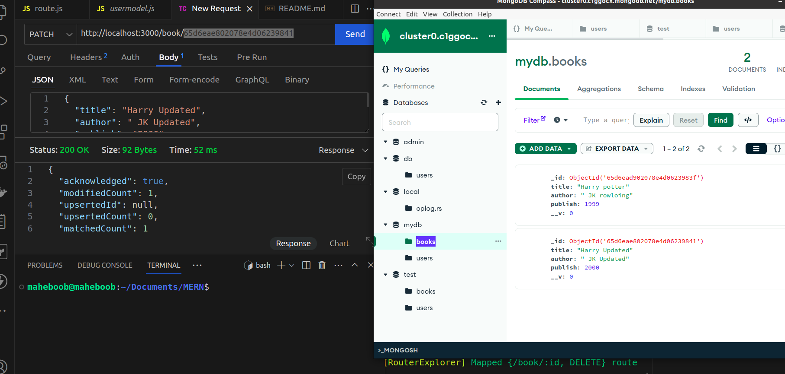
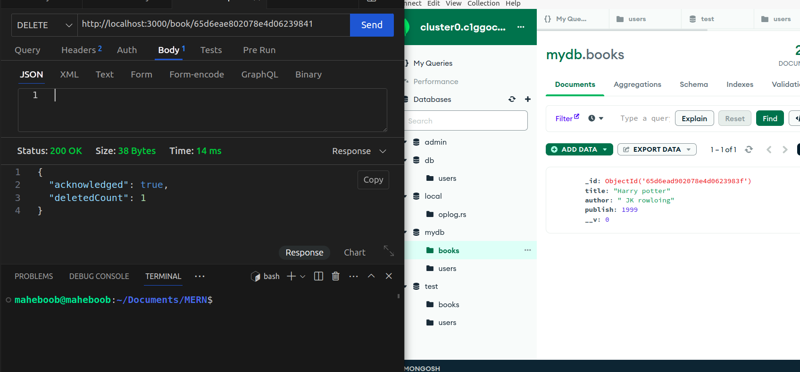

<p align="center">
  <a href="http://nestjs.com/" target="blank"></a>
</p>


## MongoDB creation

check https://docs.nestjs.com/techniques/mongodb


Installation

```bash
nest new nestMongodb

cd nest-mongodb/ && code .

npm i @nestjs/mongoose mongoose @nestjs/config

```

* you can install mongodb compass to check the same thing from local computer application that you see from browser of atlas



after downloading this package

```
sudo dpkg -i mongodb-compass_1.41.0_amd64.deb

sudo apt-get install -f

mongodb-compass

```

now copy paste the same url u got in drivers section i.e in the .env or atlas connection drivers


after this check your mongodb atlas go to connect--> drivers--> copy the connection string and enter the password not for password dont use special character if yes than
Create the user
* NOTE : while creating password for the user if using special char like ": / ? # [ ] @"
use the URL encoded format in the connection string 

For example, if your password in plain-text is p@ssw0rd'9'!, 

you need to encode your password as:

p%40ssw0rd%279%27%21


now copy paste this connection string in the local.env and write the neccsry code in app.module


# Sequence of file creation

1) schema.ts ( its same as user.entity.ts the class name defined here will be 
              creating auutomctly a colleciton(table) in mongodb)

the line "  constructor(@InjectModel(BookClass.name) private BookModel : Model<BookDocument> )"
Model<BookDocument> is a REPOSTIRY( a array or a class that has all the objects)

export const BookSchema = SchemaFactory.createForClass(BookClass)
here this will actually be creating the colleciton/table in MongoDB





this line in schema.ts "export type BookDocument = BookClass & Document"
is basically creating a object with the structure defined in BookClass and converting it in Document form to store it in DB


2) import the above in book.module.ts

3) create book.dto matching the schema defined in schema.ts

4) now in service


Creating Book POST call



GET call for FindAll method 



PATCH (updating) call ->
note put updatest the record if id mathces if not it will create a new record if its not exist


DELETE call for removing



by now we are using builtin Repository

but you can use custom repository( in which the database interaction is written)


https://docs.nestjs.com/recipes/mikroorm#using-custom-repositories


